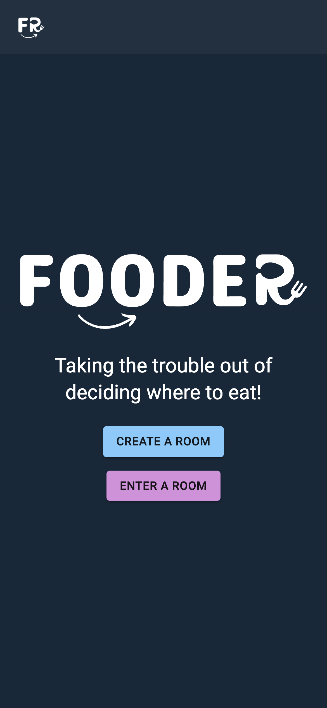
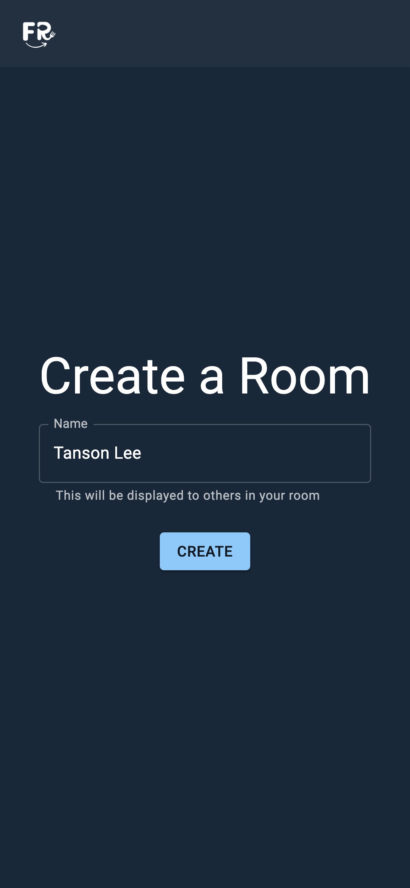
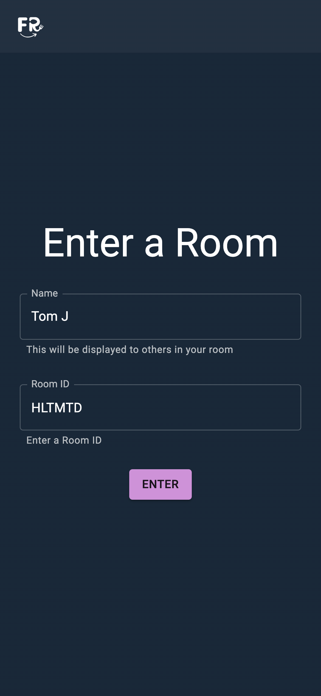
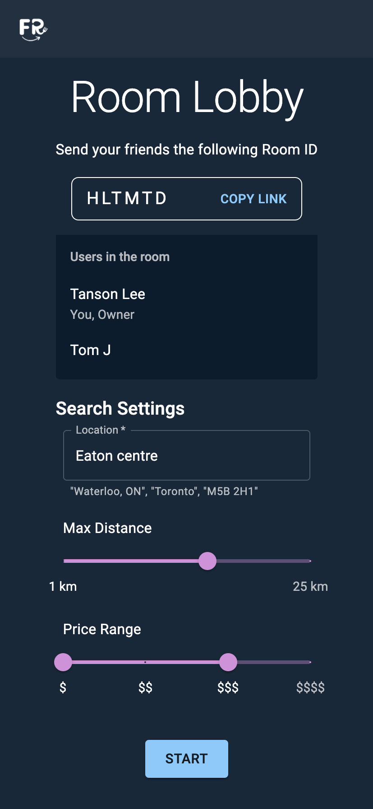
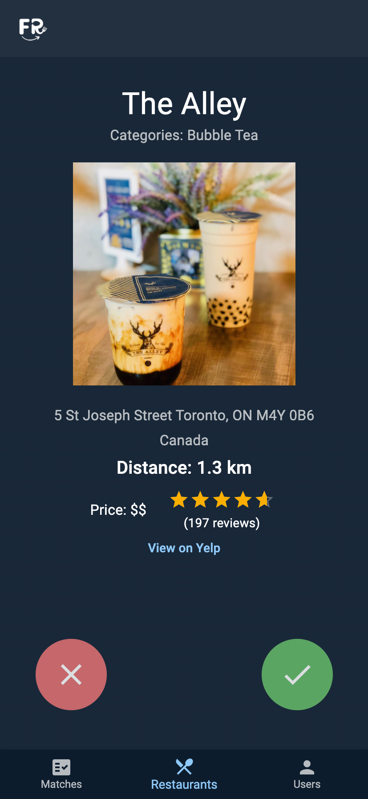

# Fooder

Hosted site here: [https://fooderweb.netlify.app/](https://fooderweb.netlify.app/)

Backend code here: [Backend](https://github.com/josephperez3/fooder-backend)

Fooder is an app that helps people decide where to eat.

Using Node.js, Socket.io, and the Yelp REST API, you can create rooms with people you are dining with. Everyone will indicate their preferences on restaurants found through Yelp. When all users in a room swipe left on a restaurant, the restaurant is displayed, allowing users to easily see restaurants that everyone agrees on.

1. Home Page
2. Creating a Room
3. Entering a Room
4. Room Lobby
5. Matching Restaurants

